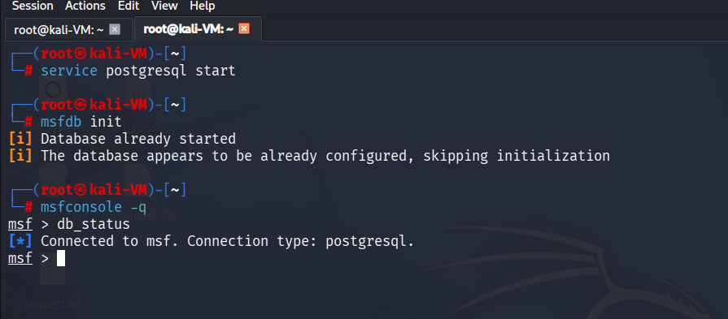
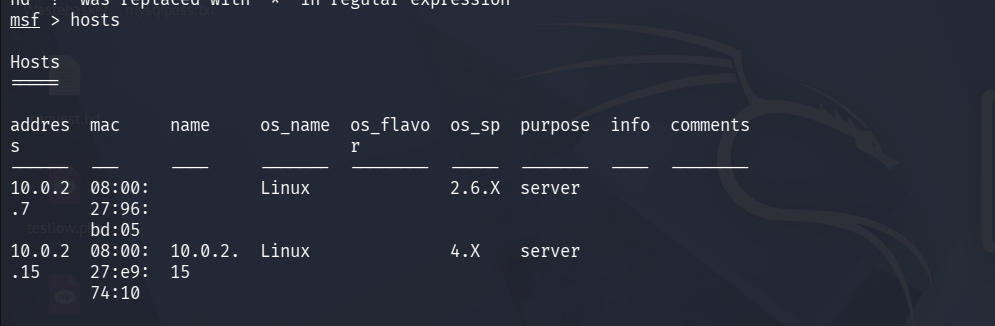
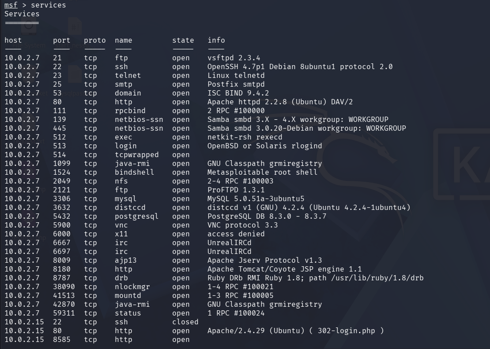
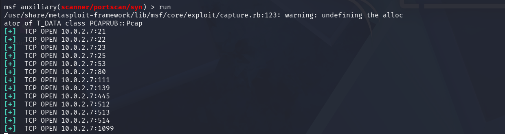

# Phase 1 — Reconnaissance

> **Objective:** Gather as much information about the target as possible before any exploitation attempt. Identify open ports, running services, software versions, and operating system details.

---

## Setting Up the MSF Database

Before launching Metasploit, PostgreSQL was started so all findings could persist between sessions. This allows modules like `db_nmap` to store results and enables commands like `hosts`, `services`, `vulns`, and `loot` to function throughout the engagement.

```bash
# Start PostgreSQL
service postgresql start

# Initialise MSF database schema (first time only)
msfdb init

# Launch Metasploit Framework console in quiet mode
msfconsole -q

# Verify database is connected
db_status
```



---

## Full Service Version Scan with db_nmap

`db_nmap` integrates Nmap directly with the MSF database, automatically storing all results for use by subsequent modules. Metasploitable 2 intentionally runs a large number of vulnerable services across many ports, so a full port scan was performed.

```bash
# -sS  : Stealth TCP SYN scan
# -sV  : Probe open ports to determine exact service versions
# -sC  : Run default NSE scripts for additional service enumeration
# -O   : Enable OS detection via TCP/IP stack fingerprinting
# -PN  : Skip host discovery (treat host as online)
# -p-  : Scan all 65535 ports, not just the top 1000
db_nmap -sS -sV -sC -O -PN -p- 10.0.2.7

# Review all discovered hosts stored in database
hosts
```



```bash
# Review all discovered services and versions
services
```



### Why `-sV`?
Identifying exact service versions is critical for matching discovered services to known CVEs and MSF exploit modules. For example, knowing the target runs **vsftpd 2.3.4** immediately identifies a specific backdoor vulnerability rather than just a generic vsftpd service.

---

## MSF Auxiliary SYN Scanner

The SYN scanner sends only the initial SYN packet of the TCP handshake. If the target responds with SYN-ACK, the scanner sends an RST to close the connection — confirming the port is open. This technique is faster than a full TCP connect scan and generates fewer log entries on the target.

```bash
use auxiliary/scanner/portscan/syn
show options
set RHOSTS 10.0.2.7
run
```



---

## Results Summary

| Port | Service | Version |
|------|---------|---------|
| 21   | FTP     | vsftpd 2.3.4 |
| 22   | SSH     | OpenSSH 4.7p1 |
| 25   | SMTP    | Postfix |
| 80   | HTTP    | Apache 2.2.8 |
| 139/445 | SMB  | Samba 3.0.20 |
| 1099 | Java RMI | — |
| 5432 | PostgreSQL | 8.3.0–8.3.7 |
| 8180 | HTTP (Tomcat) | Apache Tomcat |

---

➡️ [Phase 2 — Scanning & Vulnerability Enumeration](./02-enumeration.md)
