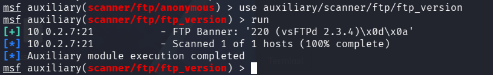
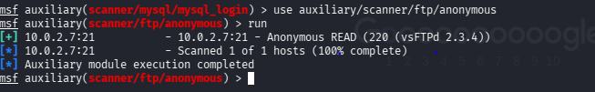
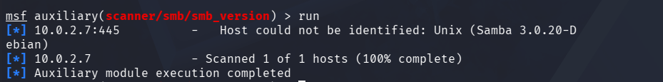
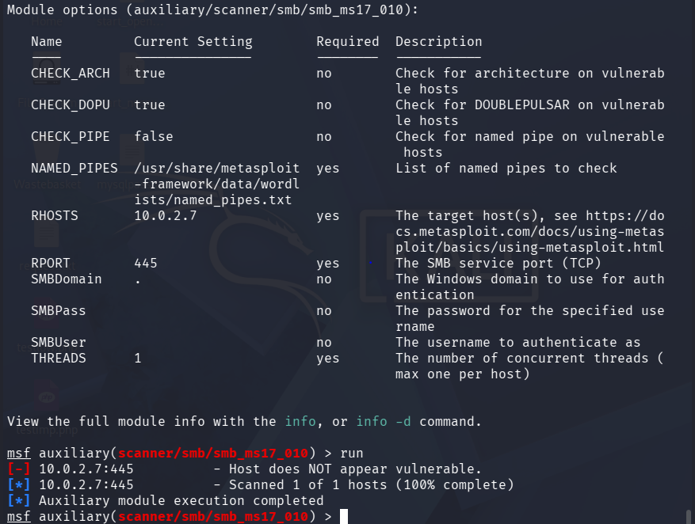
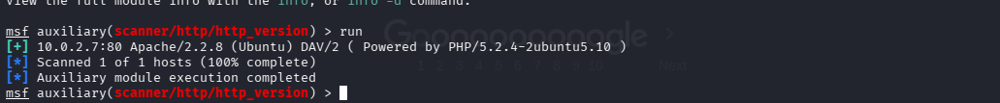
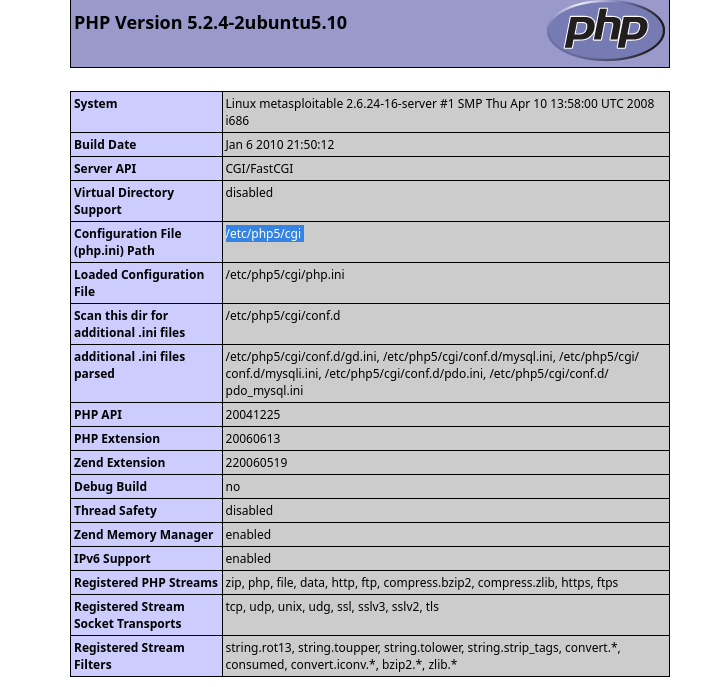

# Phase 2 — Scanning & Vulnerability Enumeration

> **Objective:** Perform deep enumeration of specific services identified during reconnaissance. Confirm service versions, identify misconfigurations, and validate vulnerabilities before exploitation.

---

## FTP Service Enumeration

FTP version enumeration was prioritised because Metasploitable 2 runs **vsftpd 2.3.4**, which contains a known backdoor. This was first identified from the `db_nmap` result and confirmed using the `ftp_version` module.

```bash
use auxiliary/scanner/ftp/ftp_version
set RHOSTS 10.0.2.7
run
```



### Anonymous FTP Login Check

An anonymous login check was also performed to test for a common FTP misconfiguration that could allow unauthenticated file access.

```bash
use auxiliary/scanner/ftp/anonymous
run
# Anonymous login allows file access without credentials
```



---

## Samba Service Enumeration

Samba enumeration is a high priority as SMB servers have multiple known vulnerabilities. The `smb_version` module was used to confirm the exact Samba version, which was then cross-referenced against known vulnerability databases.

```bash
# Check if SMB ports are open
services -p 139,445

# Enumerate Samba version on ports 139 and 445
use auxiliary/scanner/smb/smb_version
set RHOSTS 10.0.2.7
run
```



### MS17-010 Vulnerability Check

The `smb_ms17_010` scanner confirms whether the vulnerability is present without delivering a payload.

```bash
# Check MS17-010 Vulnerability
use auxiliary/scanner/smb/smb_ms17_010
set RHOSTS 10.0.2.7
run
```



---

## HTTP Service Enumeration

### Server Fingerprinting

HTTP fingerprinting was performed using the `http_version` auxiliary module to identify the web server software and version.

```bash
# Fingerprint the web server software and version
# Reads the Server response header and other HTTP headers
use auxiliary/scanner/http/http_version
set RHOSTS 10.0.2.7
run
```



The output confirmed **Apache 2.2.8**, **PHP 5.2.4**, and the **DAV/2** module. The PHP configuration information further revealed the technologies supporting the application.



### Web Directory Enumeration

```bash
# Discovers hidden directories and application paths
use auxiliary/scanner/http/dir_scanner
set RHOSTS 10.0.2.7
run
```


---

## SMTP Service Enumeration

The `smtp_enum` module was used to enumerate valid user accounts on the target via port 25. Extracted usernames can be used for brute-force attacks in later stages.

```bash
use auxiliary/scanner/smtp/smtp_enum
set RHOSTS 10.0.2.7
run
```


---

## Vulnerability Scanning with Nessus

A dedicated vulnerability scan was performed using a custom scanning policy on Nessus. The results provided CVSS-scored vulnerabilities which were cross-referenced with available MSF modules in subsequent phases.


---

## Summary of Findings

| Service | Port | Version Confirmed | Key Finding |
|---------|------|-------------------|-------------|
| FTP | 21 | vsftpd 2.3.4 | Known backdoor (CVE-2011-2523) |
| FTP | 21 | — | Anonymous login enabled |
| SMB | 139/445 | Samba 3.0.20 | CVE-2007-2447 (usermap_script) |
| HTTP | 80 | Apache 2.2.8 / PHP 5.2.4 | PHP CGI argument injection |
| HTTP | 80 | — | Multiple directories exposed |
| SMTP | 25 | Postfix | Valid usernames enumerated |

---

➡️ [Phase 3 — Credential Discovery](./03-credential-discovery.md)
