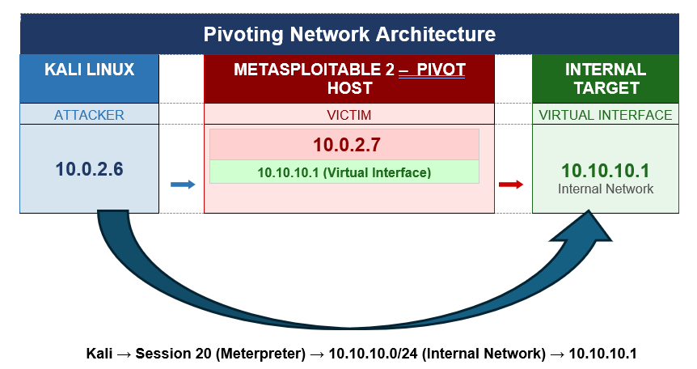
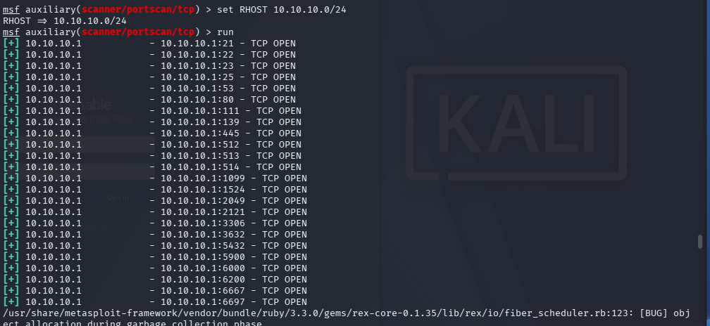

# Phase 6 — Pivoting

> **Objective:** Use the compromised host as a pivot point to reach an otherwise inaccessible internal network segment, demonstrating the Metasploit Framework's ability to extend an attack through network boundaries.

---

## Lab Environment Configuration

To simulate real network segmentation, a virtual network interface was configured on Metasploitable 2. This created a logical internal subnet (`10.10.10.0/24`) that is accessible from Metasploitable 2 but has **no direct route from Kali Linux**.



---

## Step 1 — Configure Virtual Interface on Metasploitable 2

A secondary IP address was added to `eth0` on Metasploitable 2 to simulate the internal network segment. These commands were executed directly on the Metasploitable 2 VM console.

```bash
# Verify current interfaces
ifconfig

# Add a secondary IP to eth0 (10.10.10.1/24)
sudo ip addr add 10.10.10.1/24 dev eth0

# Ensure the eth0 interface is active
sudo ip link set eth0 up

# Verify both IPs are assigned to eth0
ip addr show eth0
```


---

## Step 2 — Verify Kali Cannot Reach the Internal Network

Before configuring the pivot, it was confirmed that Kali has no direct path to the internal subnet.

```bash
# Run from Kali BEFORE configuring the MSF pivot route
ping 10.10.10.1 -c 3
```


> All packets were lost — confirmed **no direct route** from Kali to `10.10.10.0/24`.

---

## Step 3 — Add Pivot Route via autoroute

The `autoroute` post-exploitation module discovers all subnets reachable from the compromised host and injects routes into MSF's internal routing table. Once added, all MSF modules can reach those subnets through the active Meterpreter session.

```bash
# Read the pivot host's network interfaces
run get_local_subnets

# Inject the internal subnet into MSF's routing table
run post/multi/manage/autoroute ACTION=ADD SUBNET=10.10.10.0 NETMASK=/24

# Verify the route was registered
run get_local_subnets
```


> The `10.10.10.0/24` route was successfully injected. All subsequent MSF modules targeting this subnet will route their traffic through the Meterpreter session on Metasploitable 2.

---

## Step 4 — Scan Internal Network Through the Pivot

With the route in place, a TCP port scan was run against the entire internal subnet directly from the MSF console — without any direct network path from Kali.

```bash
use auxiliary/scanner/portscan/tcp
show options
set RHOSTS 10.10.10.0/24
run
```



> The TCP scanner successfully reached and returned results for the internal subnet **through the pivot route**.

---

## Observations

- The internal subnet in this experiment was simulated on the **same physical machine** as Metasploitable 2 via a virtual interface. Because both `10.0.2.7` and `10.10.10.1` belong to the same host, running exploit modules against `10.10.10.1` produced port conflicts (e.g., port 6200 already in use from Phase 4).
- This is **not a failure of the MSF pivoting architecture** — it is a constraint of simulating two network segments on a single machine.
- In a production environment with a **separate machine** on the internal subnet, the same autoroute setup would deliver full exploit access to that host through the established pivot.

---

➡️ [Phase 7 — Persistence & Backdoor Creation](./07-persistence.md)
